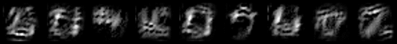

# PyTorch CBC



A PyTorch implementation of the NeurIPS 2019 paper "[Classification-by-Components: Modeling Probabilistic Reasoning over a Set of Components](https://papers.nips.cc/paper/8546-classification-by-components-probabilistic-modeling-of-reasoning-over-a-set-of-components)"

# Google Colab demo:

[link](https://colab.research.google.com/drive/1h5ZJnrdVcTx_7NJl8YS4xsB5HlCiOYPb "Link to torch-cbc in Google Colab")

## Install requirements

```
pip install -r requirements.txt
```

## To train MNIST 

```
python mnist.py
```